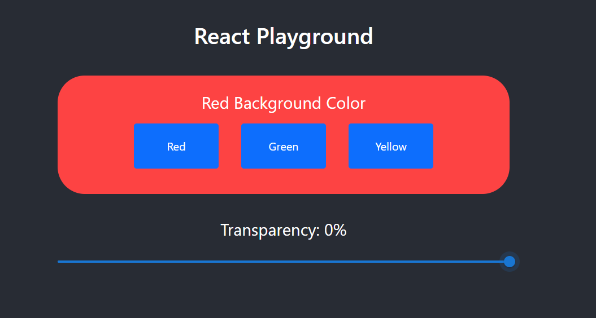
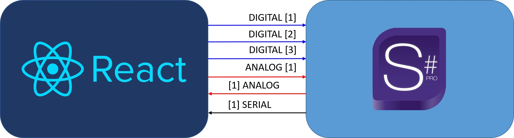

<p align="center">
  </img>
</p>

## Crestron React App

This project is made as a part of the Crestron full-stack tutorial.
In this project, I combined React on frontend, and SIMPL#Pro on backend, and this project can serve you as a playground for your ideas, and for testing purposes. 
Be aware that I didn't always use the best practices in the tutorial, so have that in mind if you want to use it for a bigger project.

## Install

After you cloned the project, run the following command in the terminal:

```bash
npm install
````

## Available Scripts

In the project directory, you can run:

### `npm start`

Runs the app in the development mode.\
Open [http://localhost:3000](http://localhost:3000) to view it in the browser.

The page will reload if you make edits.\
You will also see any lint errors in the console.

### `npm "deploy:one-step"`

Launches the build, archive, and deploy scripts, and uploads it to your touchscreen. Make sure that you set the correct IP address of your touchscreen inside the package.json file, under the deploy script. The current IP address is 192.168.1.101.

## Signals between frontend and backend

You can see in the picture below that there are 6 signals in the project. The frontend is sending 3 digital (boolean) signals and 1 analog (number) signal. Also, it's receiving 1 analog (number) signal and 1 serial (string) signal.

<p align="center">
  </img>
</p>
